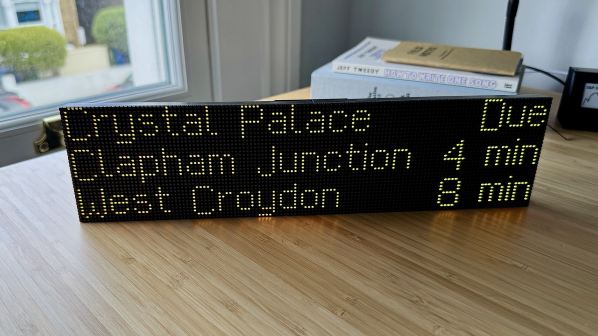
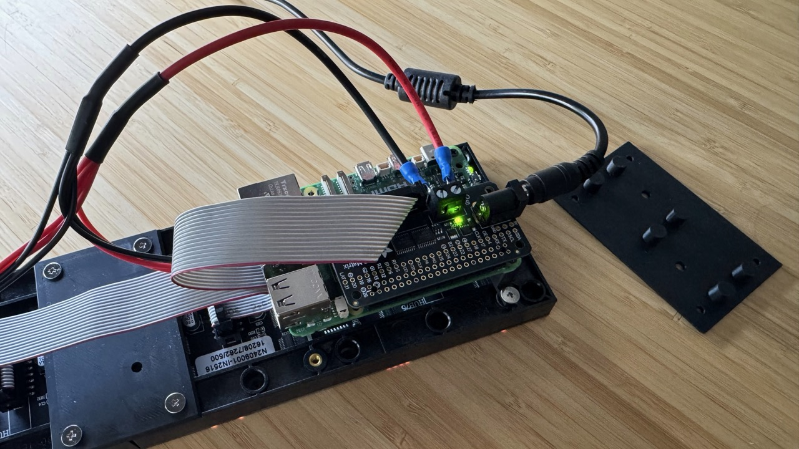

# LED Matrix Arrivals

Public-transit arrivals on a 128×32 HUB75 LED display, driven by a Raspberry Pi 5. This is the Python-side renderer that calls the [arrivals-kmp](https://github.com/jdamcd/arrivals-kmp) CLI for data.




## Hardware

- Raspberry Pi 5
- [Adafruit RGB Matrix Bonnet](https://www.adafruit.com/product/3211)
- 2× 64×32 HUB75 RGB LED panels (2.5mm pitch), chained horizontally → 128×32
- 5V power supply (10A recommended to power both panels)

### Chaining the panels

1. The Bonnet's HUB75 socket feeds panel 1's **IN**
2. Run a HUB75 ribbon from panel 1's **OUT** to panel 2's **IN**
3. Power both panels off the same 5V rail
4. The library treats the pair as a single 128×32 display via `Geometry(width=128, height=32, ...)`

If panel 2 appears flipped or mirrored, either flip it physically or change `Orientation.Normal` to `Orientation.R180` in `arrivals.py`.

## Pi software setup

Follow the Adafruit [Pi 5 RGB Matrix Panel guide](https://learn.adafruit.com/rgb-matrix-panels-with-raspberry-pi-5) first to install the Piomatter library system deps and udev rules (so `/dev/pio0` is accessible without `sudo`).

Clone this repo on the Pi and run:

```bash
./install.sh
```

This creates the venv and installs dependencies. The bundled bitmap font was generated based on [London Underground Dot Matrix Regular](https://github.com/petykowski/London-Underground-Dot-Matrix-Typeface).

## Install the arrivals CLI

The Python script calls the `arrivals` binary from [jdamcd/arrivals-kmp](https://github.com/jdamcd/arrivals-kmp). Cross-compile the native CLI for ARM Linux from a macOS or x86 Linux machine:

```bash
# In the arrivals-kmp repo
./gradlew :cli:linkReleaseExecutableLinuxArm64
```

Then copy the binary to the Pi and put it on your `PATH`:

```bash
scp cli/build/bin/linuxArm64/releaseExecutable/cli.kexe <user>@<host>:/tmp/arrivals
ssh <user>@<host> 'sudo mv /tmp/arrivals /usr/local/bin/arrivals'
```

Verify:

```bash
arrivals --json tfl --station 910GSHRDHST
```

You should get a JSON object with `station` and `arrivals` fields.

## Running

```bash
source venv/bin/activate
python arrivals.py "arrivals --json tfl --station 910GSHRDHST --platform 2"
```

## Optional: auto-start via systemd (user service)

There's a template in `systemd/arrivals-led.service`. To install:

```bash
mkdir -p ~/.config/systemd/user
cp systemd/arrivals-led.service ~/.config/systemd/user/
# Edit the ExecStart line to point at your preferred station.
systemctl --user daemon-reload
systemctl --user enable --now arrivals-led
loginctl enable-linger $USER   # so it runs when you're not logged in
```

## Parts

I've included a couple of models for 3D-printed parts that may be useful:

- Bracket to connect the 2x LED panels horizontally (with M3 screws)
- Riser to attach the Pi 5 (with M2.5 & M3 screws)



## Tips & troubleshooting

- **`/dev/pio0: permission denied`**: The Adafruit udev rule isn't in place. Check the Pi 5 guide's udev section.
- **Power**: If you have any power issues, try powering the Pi 5 separately via the standard 27W USB-C adapter.
- **Certain rows flicker briefly during data refresh**: The Piomatter blit thread (which sends frame data to the PIO hardware) can be preempted by the Linux scheduler, especially when a subprocess is running. To fix this, isolate a CPU core for the blit thread:
  1. Install the patched Piomatter from [this branch](https://github.com/lehni/Adafruit_Blinka_Raspberry_Pi5_Piomatter/tree/pin-blit-thread-to-isolated-cpu) which pins the blit thread to an isolated core:
     ```bash
     pip install git+https://github.com/lehni/Adafruit_Blinka_Raspberry_Pi5_Piomatter.git@pin-blit-thread-to-isolated-cpu
     ```
  2. Reserve CPU core 3 by appending `isolcpus=3` to the existing line in `/boot/firmware/cmdline.txt`, then reboot.

  See [Piomatter PR #79](https://github.com/adafruit/Adafruit_Blinka_Raspberry_Pi5_Piomatter/pull/79) for more details.
